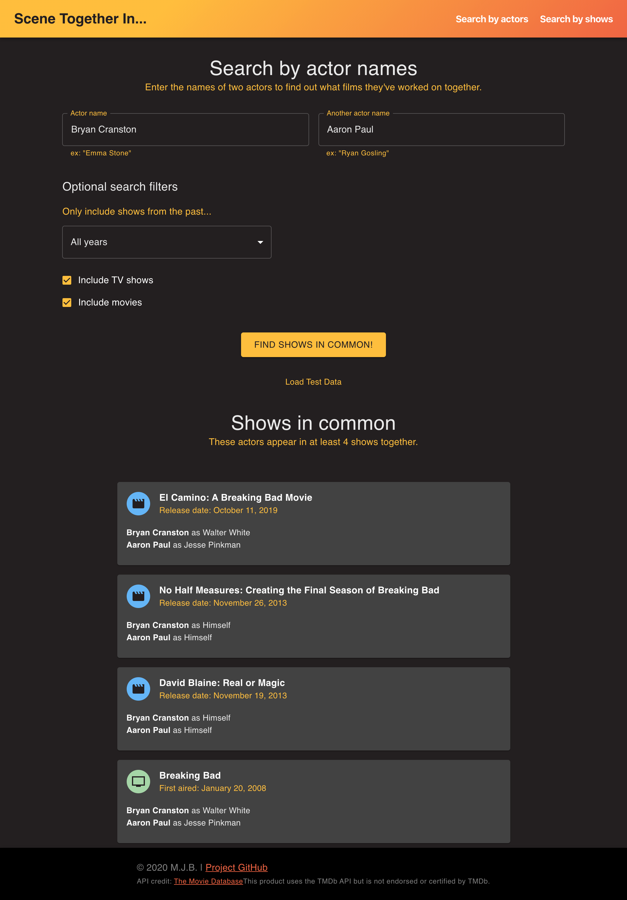

## Scene Together
This is a web app I made in March 2020 to get acquainted with React. It is fully functional and can be used on desktop or mobile. Go to [scene-together.herokuapp.com](http://scene-together/herokuapp.com) to try it out! (Give it a few seconds to load, it's on a free dyno :P ) 

* Input the names of two actors see what shows they've worked on together.
* Input the names of two shows and see what actors they have in common.
* Use the "Load test data" button if you want to skip the form inputs and just see it work 

The data is from [The Movie Database](http://themoviedb.org) and may be incomplete for obscure people or shows.




### To run locally (for development)
1. Git clone this repo 
2. In the project root, create a new file named ```.env.local ```
3. Add this line: 

```REACT_APP_API_KEY_TMDB="abcdefg"```

...where ```"abcdefg"``` is your TMDB API key (Get an account and API key [here](https://developers.themoviedb.org/3/getting-started/introduction).)

4. In Terminal, navigate to project directory and enter: ```npm install```
5. In Terminal: ```npm start```

### Deploying
Fresh machine/install:

1. Install Heroku CLI
2. Set up Heroku app as a remote: https://devcenter.heroku.com/articles/git#tracking-your-app-in-git
3. ```heroku buildpacks:set mars/create-react-app ``` (may already be done, this is a "once per project" thing)

Subsequent deploys:

``` git push heroku master```

This project was bootstrapped with [Create React App](https://github.com/facebook/create-react-app).
